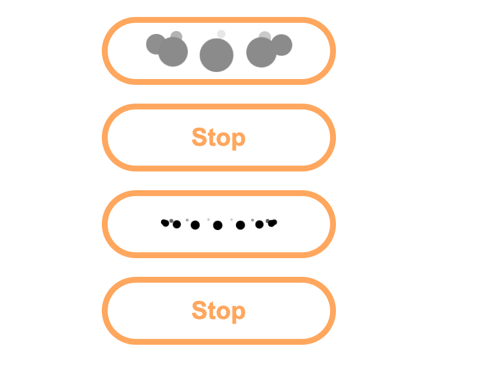

## Installation Instructions
* clone or download
* bring in the script and defer in the head of document. run the script.js 
* bring in the stylesheet.css
* Or use both from cdn link:
```
    <script src="https://cdn.jsdelivr.net/gh/bradicalone/loader@1.2.0/dist/index.min.js"></script> 
    <link rel="stylesheet" href="https://cdn.jsdelivr.net/gh/bradicalone/loader@0.1.5/dist/stylesheet.css">
```
## Usage

This exposes `Loading` by default. To make it ready for use, you need to initialize the Constructor to use it's methods:

```javascript
/**
* @param {Object} data Information about the loader.
* @param {HTMLElement} data.containerElement The element id of the loader cirlces is going to be in
* @param {number} data.count how many rotated circles. | defualt: 5
* @param {Number|String} data.circleSize size of circle in pixels | default: half target container devided by count
* @param {String} data.color color of circles | default: black
* @param {Number|String} data.width how much width of the whole rotation in pixels | default: half width of target container
*/
const loader = new Loading({
    containerElement: document.getElementById('btn-loader'),
    count: 8,
    circleSize: 18,
    color: '#969696',
    width: '125px'
})

document.getElementById('btn-loader').onclick = function () {
    // Start the animation loader on click or possibly waiting for the page to load
    loader.initRotate()
}
document.getElementById('btn-loader-stop').onclick = function () {
    // Stop the animation loader on another click event or possibly when page is done loading
    loader.clearRotation()
}

/**
* @param {Object} data Information about the loader.
* @param {HTMLElement} data.containerElement The element id of the loader cirlces is going to be in
* @param {number} data.count how many rotated circles. | defualt: 5
* @param {Number|String} data.circleSize size of circle in pixels | default: half target container devided by count
* @param {String} data.color color of circles | default: black
* @param {Number|String} data.width how much width of the whole rotation in pixels | default: half width of target container
*/
const loaderTwo = new Loading({
    containerElement: document.getElementById('btn-loader-two'),
    count: 6,
    circleSize: '2px'
})

document.getElementById('btn-loader-two').onclick = function () {
    loaderTwo.initRotate()
}
document.getElementById('btn-loader-stop-two').onclick = function () {
    loaderTwo.clearRotation()
}
```

## Playground
* Open HTML file in the browser
* Play with the constructor params `test-script.js` for each button


